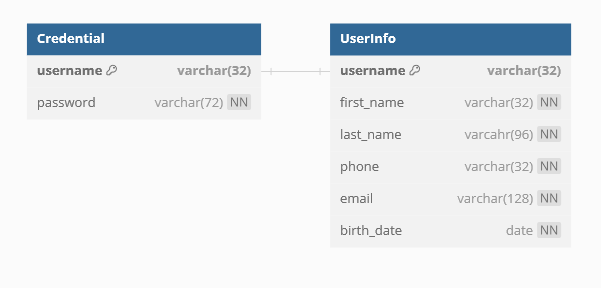

# Woke Challenge - Backend in Kotlin with Gradle

Esse projeto foi iniciado com [Spring Initializr](https://start.spring.io/).

### DDD

Para organização e manutenção de código, optou-se pelo modelo de Domain Driven Design, orientado à modelos que determinam o domínio do projeto.

A organização de arquivos se dá no formato:

#### Aplication/Controller

Responsável por armazenar classes controladores da aplicação (API's).

#### Infra

Responsável por armazenar classes que atuam diretamente com a infra-estrutura da aplicação. (Acesso ao banco, classes DTO's)

#### Model

Responsável por armazenas as classes de modelo, onde se encontram o Business Model/Regras de negócio da aplicação.

#### Services

Responsável por armazenar classes de serviços/transformação/delegação de tarefas.

### Dependências

- Spring WEB
- MySQL Connector
- JDBC API
- Liquibase Migration
- Docker Compose
- Spring Security
- JWT Auth0

## Estrutura de Dados



## API's

### AuthController (API de Autenticação)

#### POST `/auth/login`

Realiza uma tentativa de login.

```
{
  "username": <username>,
  "password": <password>
}
```

#### POST `/auth/create`

Realiza uma tentativa de criação de credenciais de usuário.

- O controlador criptografa as senhas antes de salvar os dados no banco.

```
{
  "username": <username>,
  "password": <password>
}
```

#### GET `/auth/dev/index`

[DEV] Realiza a listagem de todas as credenciais cadastradas.

- Endpoint com fins apenas de desenvolvimento.

### UserInfoController (API de Informações Pessoais)

Esta API requer um token de autenticação fornecido pela API de Login para acesso.

#### POST `/:username/info`

Realiza a inserção de dados pessoais para uma Credencial existente.

```
{
  "firstName": <first_name>,
  "lastName": "<last_name>",
  "phone": "<phone_format>",
  "email": "<email_format>",
  "birthDate": <string dd/MM/yyyy>
}
```

#### GET `/:username/info`

Recupera os dados pessoais de uma Credencial existente.

### DummyConsumerController (API visando simular o consumo por API de empresas parceiras)

#### POST `/:username/info`

```
{
  "fullName": <first_name>,
  "phone": "<phone_format>",
  "email": "<email_format>",
  "birthDate": <string dd/MM/yyyy>
}
```

## Model

Uma breve descrição do modelo/regras de domínio.

### /Respositories

Classes de interface que estabelecem um "contrato" com infra.

### /Exceptions

Classes que abrangem excessões do modelo da aplicação.

### Credential

Raiz de agregado representando os dados necessários para uma Credencial se encaixar no modelo de negócio.

#### Username

Modelo parcial responsavel por validar um nome de usuário. Um usuário deve ter:

- Pelo menos 5 caracteres.
- No máximo 32 caracteres.
- Ser composto de apenas letras e números.

#### Password

Modelo parcial responsavel por validar a senha de um usuário. Uma senha deve ter:

- Pelo menos 8 caracteres.
- No máximo 32 caracteres.
- Conter pelo menos um digito numérico.
- Conter pelo menos uma letra maiúscula.
- Conter pelo menos um caractere especial.

Senhas são criptografadas antes de serem salvas no banco.

### UserInfo: String

Raiz de agregado representando os dados necessários para descrever as informações de perfil de um usuário que se encaixa no modelo de negócio.

#### FirstName: String

Modelo parcial responsavel por validar o primeiro nome de um usuário. Uma primeiro nome deve ter:

- No máximo 32 caracteres.
- Ser composto apenas de letras ou espaços.

#### LastName: String

Modelo parcial responsavel por validar o complemento de nome de um usuário. Um complemento de nome deve ter:

- No máximo 96 caracteres.
- Ser composto apenas de letras ou espaços.

#### Phone: String

Modelo parcial responsavel por validar o número de telefone de um usuário. Um número de telefone de nome deve:

- Atender à seguinte RegEx: `\^(\\+[1-9]{2})? ?\\(?[1-9]{2}\\)? ?(?:[2-8]|9[0-9])[0-9]{3}-?[0-9]{4}$\`

#### Email: String

Modelo parcial responsavel por validar o email de um usuário. Um email deve:

- Atender à seguinte RegEx: `\^[\\w-\\.]+@([\\w-]+\\.)+[\\w-]{2,4}\$\`

#### BirthDate: Date

Modelo parcial responsavel por validar a data de nascimento de um usuário. Uma data de nascimento deve:

- Ser anterior ao dia atual.

## Migrações

[Aqui](https://github.com/Gustavoesm/woke-backend-challenge/blob/main/src/main/resources/db/changelog/db.changelog-master.yaml).

## Como executar a aplicação

Para executar a aplicação, é necessário:

- Gradle.
- Docker (with Compose plugin)

Para executar:

- Defina uma variável de ambiente `JWT_SECRET` com uma palavra chave qualquer para encriptar os tokens de acesso.
- Na pasta raiz do projeto, execute o comando `./gradlew bootRun` ou pela IDE IntelliJ, execute o arquivo `Aplication.kt`.
  - Se tudo der certo, o gradle deverá subir o container docker do MySQL automaticamente na sua máquina, mas caso contrário, talvez seja necessário subir o container manualmente.

## Disclaimer

Visando atender ao prazo estipulado para a implementação das tarefas, preferi não implementar os testes unitários para não gastar muito do tempo necessário para a implementação. Caso seja desejável, posso implementar tais testes nos próximos dias.
